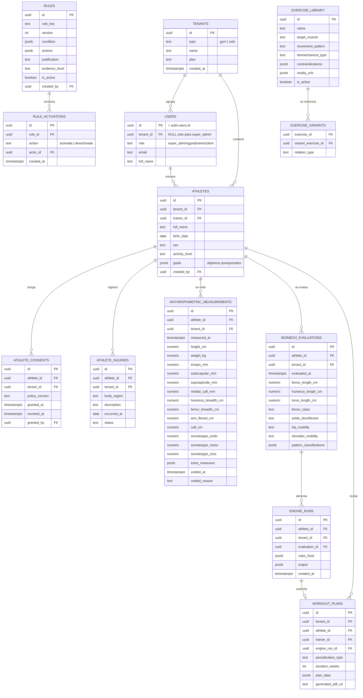

# GiosLab — Modelo de datos (v1)

> Tarea **0.4**. Este documento se decide **antes** de escribir migraciones.
> Las migraciones del grupo 1 deben implementar lo que está aquí; si algo cambia,
> se edita este archivo primero.

Estado: **v1 — decidido salvo lo listado en §7 (pendiente de Giovanni).**

---

## 1. Decisiones estructurales

### 1.1 El tenant es una entidad propia

Un entrenador puede operar sin gimnasio (plan individual), así que "tenant = gimnasio"
no alcanza. Se crea una tabla `tenants` donde un tenant es **un gimnasio o un
entrenador independiente**.

Toda tabla de negocio lleva `tenant_id`. Eso hace que la política de RLS sea
**idéntica en todas**:

```sql
USING (tenant_id = mi_tenant())
```

Una sola función, una sola forma de política, auditable de un vistazo. La alternativa
—resolver la pertenencia con JOINs desde `athletes` hacia `trainers` hacia `gyms`—
obliga a escribir una política distinta por tabla y por rol, que son cuatro. Con datos
clínicos de por medio, el modo aburrido y repetitivo es el correcto (`CLAUDE.md` §3.2).

### 1.2 La biblioteca de ejercicios y las reglas son globales

No llevan `tenant_id`. Son propiedad de la plataforma, las cura `super_admin`
(Giovanni) y todos los tenants las leen. La metodología GQ **es** el producto: si cada
gimnasio la edita, el motor deja de ser confiable y el diferencial se diluye.

Pasar después a un modelo mixto (biblioteca global + añadidos por tenant) es agregar
una columna `tenant_id` nullable. Al revés sería una migración de datos. Se eligió la
dirección reversible.

### 1.3 Tres cambios frente al boceto del `CLAUDE.md` §4

El boceto de `CLAUDE.md` dice que se ajuste según lo que salga de esta tarea. Estos son
los ajustes, con su motivo:

| Boceto original | Aquí | Por qué |
|---|---|---|
| `athletes.age` | `athletes.birth_date` | La edad cambia sola. Guardar el número obliga a actualizarlo o queda mintiendo; la fecha se calcula y nunca envejece mal. |
| `athletes.height_cm`, `weight_kg` | Movidos a `anthropometric_measurements` | §3.5 dice que las mediciones se versionan y no se sobreescriben. Peso y talla **son** mediciones: Heath-Carter necesita la talla del día de la toma, no la última conocida. |
| `athletes.consent_at` | Tabla `athlete_consents` | Una columna con fecha no puede demostrar **qué versión** de la política se aceptó, ni registrar una revocación. La Ley 1581 exige consentimiento demostrable (§3.7). |

---

## 2. Diagrama



---

## 3. Convenciones aplicadas a todas las tablas

- **Llave primaria:** `uuid` con `gen_random_uuid()`. No `serial`: un ID secuencial en
  una URL revela cuántos atletas tiene la competencia.
- **Auditoría:** `created_at timestamptz not null default now()`, `updated_at` mantenido
  por trigger, y `created_by uuid references users(id)` en toda tabla que un humano
  escribe.
- **Borrado:** nada de `DELETE` en tablas con historial clínico. Se usa `archived_at`
  cuando haga falta ocultar algo.
- **Fechas:** siempre `timestamptz`. El servidor está en UTC y el gimnasio en Bogotá;
  guardar `timestamp` sin zona es garantía de un bug de horas.
- **RLS activado en todas**, sin excepción, desde la migración que crea la tabla.
- **`tenant_id` en toda tabla de negocio, incluso las que cuelgan de `athletes`.**
  `athlete_consents`, `athlete_injuries` y `engine_runs` podrían deducir su tenant con un
  JOIN, pero entonces su política de RLS sería distinta a la de las demás. Se duplica la
  columna a propósito: el objetivo de §1.1 es que **todas** las políticas se lean igual.
  Un trigger la copia desde `athletes` al insertar, para que no se pueda desincronizar.

---

## 4. Tablas versionadas (§3.5)

`anthropometric_measurements` y `biomech_evaluations` **nunca se actualizan**. Cada toma
es una fila nueva con su `measured_at` / `evaluated_at`.

Consecuencia práctica: el "estado actual" de un atleta no es una columna, es una
consulta —la fila más reciente—. El valor del producto está en la evolución, así que la
ficha del atleta (2.9) compara filas, no lee un snapshot.

```sql
-- Última medición de cada atleta
select distinct on (athlete_id) *
from anthropometric_measurements
order by athlete_id, measured_at desc;
```

Índice necesario: `(athlete_id, measured_at desc)` en ambas tablas.

### Cómo se impone la inmutabilidad (implementado en la 1.2)

No basta con escribirlo aquí. En la migración `20260819070000` **no se concede `UPDATE`
sobre las columnas de datos ni `DELETE`**: un entrenador solo puede `INSERT` y `SELECT`.
Sobreescribir un peso ya registrado devuelve `permission denied` desde Postgres, no
desde una validación de la aplicación que alguien pueda saltarse.

Pero una tabla sin salida es peor que el problema, y los errores de digitación existen.
Por eso se concede `UPDATE` **solo sobre tres columnas**: `voided_at`, `voided_by` y
`voided_reason`. La fila errónea se marca como anulada, con autor y motivo, y **sigue en
el historial**. Un `CHECK` impide anular sin motivo.

Es el patrón de una historia clínica: no se borra, se enmienda dejando rastro. El
`GRANT` a nivel de columna es lo que lo hace imposible de saltar desde la app, en vez de
una convención que alguien romperá dentro de un año.

### Unidades

Pliegues cutáneos en **mm**; diámetros óseos, perímetros y longitudes de segmento en
**cm**. Es lo que usa el protocolo Heath-Carter, y mezclarlas es la vía rápida a un
somatotipo que no cuadra con el Excel de Giovanni.

Todas las columnas numéricas llevan un `CHECK` de rango **anti-digitación**, no clínico:
atrapan un `1750` donde iba `175` al llenar el formulario de pie en el gimnasio. Son
rangos deliberadamente generosos; no rechazan valores atípicos legítimos.

### Sobre `extra_measures jsonb`

Las columnas nombradas cubren exactamente lo que exige el protocolo Heath-Carter:
4 pliegues (tríceps, subescapular, supraespinal, pantorrilla medial), 2 diámetros óseos
(húmero, fémur) y 2 perímetros (brazo flexionado, pantorrilla), más talla y peso.

Si el Excel de Giovanni mide más cosas, entran en `extra_measures` sin migración. Lo que
la fórmula necesita va en columnas propias porque se consulta y se valida; lo demás va
en JSON. **No inventé campos**: los que están son los del método publicado.

---

## 5. Las reglas como datos (§3.1)

Una regla es una fila **inmutable**. "Editar" una regla es insertar una versión nueva con
el mismo `rule_key` y `version + 1`, y mover el `is_active`.

```
rule_key = 'femur-largo-dorsiflexion-limitada'
  version 1  is_active = false   ← histórico, nunca se borra
  version 2  is_active = true    ← vigente
```

Eso resuelve la 3.6 (volver a una versión anterior es reactivar una fila) y hace que
`rule_activations` sea un registro simple de quién activó o desactivó qué y cuándo.

Restricción: **una sola versión activa por `rule_key`**.

```sql
create unique index rules_una_activa_por_key
  on rules (rule_key) where is_active;
```

Sin ese índice, el motor podría aplicar dos versiones contradictorias de la misma regla
en una sola evaluación.

### Cómo se impone (implementado en la 1.3)

Mismo patrón que las mediciones: se concede `INSERT` y `SELECT`, y `UPDATE` **solo sobre
`is_active`**. La condición, las acciones y la justificación de una versión publicada no
se pueden reescribir.

Importa porque un plan de marzo apunta a la regla que lo justificó. Si esa fila fuera
editable, la justificación que ve el entrenador cambiaría retroactivamente y la
trazabilidad del producto sería ficticia.

**`rule_activations` lo escribe un trigger, no la aplicación.** Si dependiera de que el
código se acuerde de insertar la fila, el día que alguien active una regla desde el SQL
editor de Supabase el historial quedaría con un hueco silencioso. La tarea 3.6 pide saber
quién cambió qué; un registro que se puede evitar no sirve para eso.

### Por qué existe `engine_runs`

`CLAUDE.md` §3.6 exige mostrar **qué regla aplicó y por qué**. Si eso se recalcula al
vuelo, un plan generado en marzo mostraría la justificación de las reglas de agosto, que
para entonces pueden ser otras.

`engine_runs` congela la salida del motor y las reglas que dispararon, y `workout_plans`
apunta a ese run. La justificación que ve el entrenador es la que existía cuando se
generó el plan. Con datos de salud y un producto que se vende por su trazabilidad, esto
no es opcional.

---

## 6. Estrategia de RLS (insumo de la tarea 1.4)

Dos funciones auxiliares, marcadas `security definer` y `stable`:

```sql
mi_tenant() returns uuid   -- tenant_id del usuario autenticado
mi_rol()    returns text   -- rol del usuario autenticado
```

| Tabla | `super_admin` | `gym` | `trainer` | `client` |
|---|---|---|---|---|
| `tenants` | todo | el suyo (lectura) | el suyo (lectura) | — |
| `users` | todo | los de su tenant | el suyo | el suyo |
| `athletes` | todo | los de su tenant | **los suyos** | el suyo |
| `*_measurements`, `*_evaluations` | todo | los de su tenant | los de sus atletas | los suyos (Fase B) |
| `workout_plans` | todo | los de su tenant | los de sus atletas | los suyos (Fase B) |
| `exercise_library`, `rules` | escritura | lectura | lectura | — |

**Regla base para tablas de negocio:**

```sql
create policy tenant_aislado on athletes
  for all using (tenant_id = mi_tenant());
```

Y encima, para `trainer`, un filtro adicional por `trainer_id = auth.uid()`.

### Nunca escribir una condición negativa en una política

**Fallo real, encontrado y corregido en la 1.4.** La política original de `athletes` decía:

```sql
mi_rol() <> 'trainer' or trainer_id = auth.uid()   -- ❌ falla ABIERTO
```

La intención era "el entrenador solo ve los suyos". Pero para `client` la primera mitad
es verdadera, así que **un cliente veía todos los atletas de su gimnasio**, con lesiones
y composición corporal. Cada rol que no esté nombrado entra por la puerta de atrás.

La forma correcta enumera **positivamente** quién sí puede:

```sql
mi_rol() = 'super_admin'
or (tenant_id = mi_tenant()
    and (mi_rol() = 'gym'
         or (mi_rol() = 'trainer' and trainer_id = auth.uid())))   -- ✅ falla CERRADO
```

Un rol que no aparece queda fuera por defecto. Lo mismo aplica a `using (true)`: se veía
inocente en `rules`, y significaba que **cualquier cuenta de cliente podía descargarse la
matriz de reglas completa** — el activo central del negocio.

**Regla para el resto del proyecto: en una política, el silencio significa "no".** Nada de
`<>`, nada de `not in`, nada de `using (true)` sobre tablas con datos o metodología.

### Qué puede hacer un `client` en Fase A

Nada, salvo leer su propio perfil y su tenant. No es un descuido: el portal del cliente es
Fase B y todavía no existe el vínculo cliente ↔ atleta. Cuando se construya hará falta una
columna `athletes.client_user_id` y extender la política **de forma deliberada**, en una
migración que se pueda revisar.

> **Ojo con la ventana de riesgo.** Entre la 1.1 (se crean las tablas) y la 1.4 (se
> aplica RLS) existe un intervalo en el que la clave pública —que va en el bundle del
> navegador— puede leer las tablas. Por eso RLS se activa **en la misma migración que
> crea cada tabla**, aunque la política fina se afine en la 1.4. Tabla nueva sin RLS es
> un defecto, no una tarea pendiente.

### GRANT y RLS son cosas distintas

`RLS` decide **qué filas** ve un rol. El `GRANT` decide si el rol puede **tocar la
tabla**. Con las políticas perfectas pero sin `GRANT`, toda consulta responde
`permission denied` y uno pierde horas revisando políticas que están bien.

Cada migración concede explícitamente a `authenticated` y **nada a `anon`**.

> **Trampa verificada en la 1.1.** El Supabase local (`supabase start`) **no** concede
> permisos a `anon` sobre `public`, pero el proyecto alojado **sí**. Una suite de RLS
> que pasa en local puede no reflejar producción. La migración
> `20260819060000_revocar_anon.sql` iguala los dos entornos revocando `anon` y ajustando
> los privilegios por defecto para que las tablas futuras tampoco nazcan con ellos.
>
> **Toda migración nueva debe verificarse también contra el remoto**, no solo en local.

---

## 7. Pendiente de Giovanni

No modelo estos valores porque son dominio, y la fuente es él (`CLAUDE.md` §6, §7).
Hasta que respondan, las columnas quedan como `text` libre y se convierten en `enum`
después.

1. **Umbrales de clasificación ósea.** ¿A partir de qué medida un fémur es
   "Largo" / "Medio" / "Corto"? ¿Es un valor absoluto en mm o un ratio contra la talla o
   el torso? Bloquea `femur_class` y la tarea 2.4.
2. **Escalas de movilidad.** ¿`ankle_dorsiflexion` es categórica (Limitada / Normal /
   Amplia), un ángulo en grados, o centímetros del test de pared? Ídem cadera y hombro.
3. **Catálogo de patrones de movimiento.** La lista cerrada de `movement_pattern`
   (¿sentadilla, bisagra, empuje horizontal, tracción vertical…?).
4. **Niveles de evidencia.** Los valores válidos de `evidence_level`. El ejemplo del
   `CLAUDE.md` usa `criterio_profesional`; faltan los demás y su orden.
5. **Estructura de `pattern_classifications`.** Sabemos que clasifica en
   Eficiente / Compensada / De Riesgo, pero no qué patrones se evalúan ni si hay nota o
   solo categoría.
6. **¿Un entrenador ve los atletas de sus colegas del mismo gimnasio?** Es una decisión
   de producto, no técnica, y cambia la política de RLS de `athletes`.

Los puntos 1 a 5 se resuelven en la **sesión grabada de la tarea 0.5**. El 6 se puede
responder por WhatsApp.

---

## 8. Orden de migraciones (grupo 1)

Dictado por las dependencias de llaves foráneas:

| Migración | Tablas | Tarea |
|---|---|---|
| 1 | `tenants`, `users` + funciones `mi_tenant()` / `mi_rol()` | 1.1 |
| 2 | `athletes`, `athlete_consents`, `athlete_injuries` | 1.1 |
| 3 | `anthropometric_measurements`, `biomech_evaluations` | 1.2 |
| 4 | `exercise_library`, `exercise_variants` | 1.3 |
| 5 | `rules`, `rule_activations` | 1.3 |
| 6 | `engine_runs`, `workout_plans` | 1.3 |

Cada una activa RLS sobre lo que crea. Después de cada migración: `npm run db:types`.
